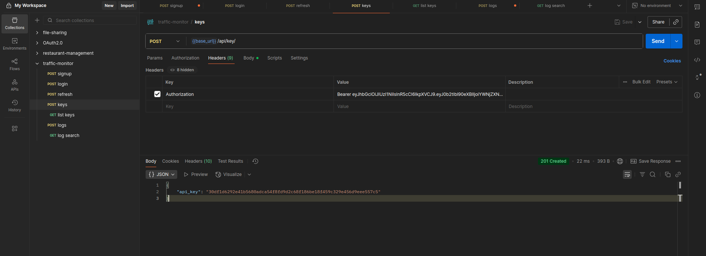
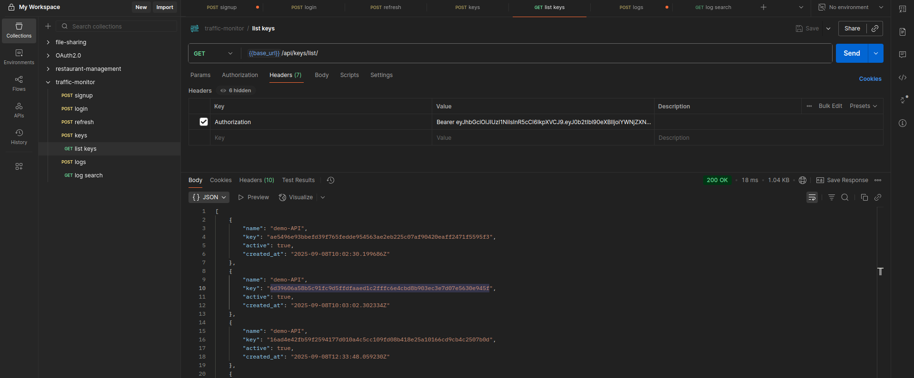
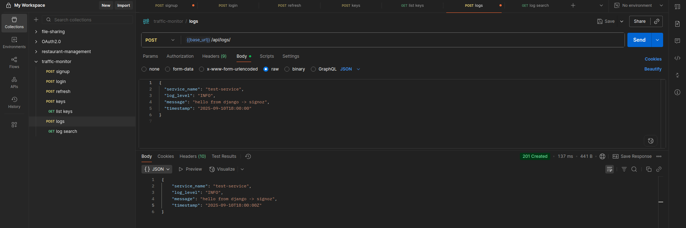
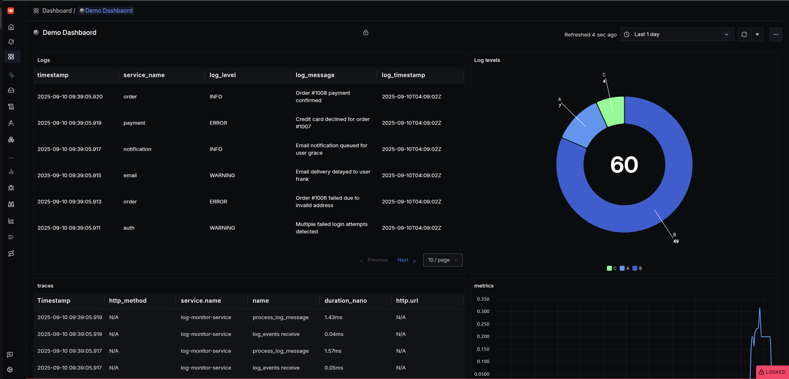
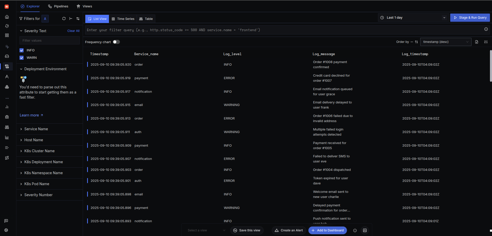
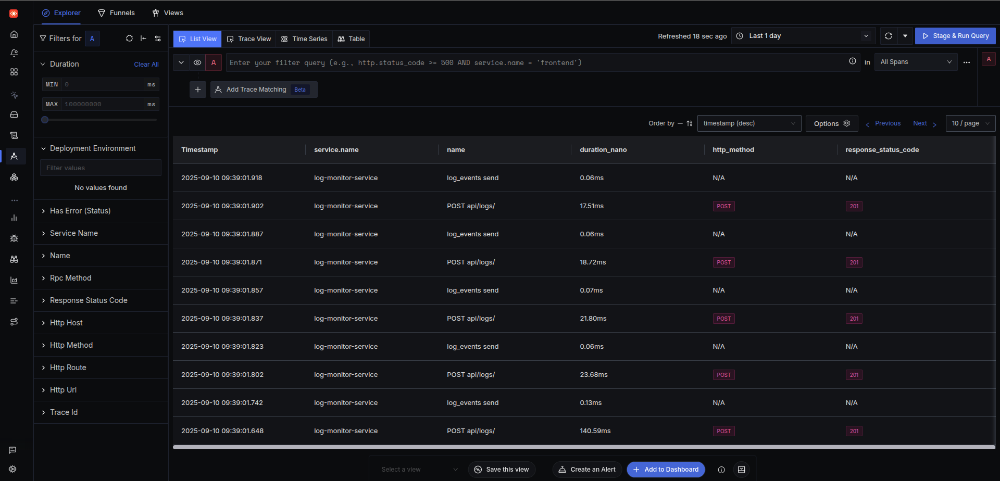

## Log Monitoring & Observability Platform

An end-to-end observability system built with Django, Kafka, PostgreSQL, Redis, and SigNoz.

It collects logs via REST APIs, buffers with Kafka, persists into PostgreSQL, applies API key security + rate limiting, and exports logs, metrics, and traces to SigNoz (via OpenTelemetry).

### Features
- Log ingestion → Clients send logs via Django REST API → Kafka → PostgreSQL.
- API Key + JWT authentication for secure API access.
- Redis-powered rate limiting (100 requests/min per API key).
- OpenTelemetry instrumentation for logs, metrics, and distributed traces.
- SigNoz dashboards for request throughput, error rate, latency (P95/P99), blocked requests.
- Alerting in SigNoz (e.g., high error rate, Kafka consumer lag).

### Tech Stack
- Backend: Django REST Framework
- Queue: Apache Kafka
- Database: PostgreSQL
- Cache/Rate limiting: Redis
- Observability: OpenTelemetry + SigNoz
- Containers: Docker / Docker Compose

### Setup & Run

1. Clone Repo

    ``` bash
    git clone --single-branch -b feature/sigNoz-integration https://github.com/0xk4n3ki/logTraffic-Monitor.git
    cd logTraffic-Monitor
    ```

    Create a .env file in the project root with the following vvariables:
    ```ini
    # Django Settings
    SECRET_KEY=your_django_secret_key

    # Database (PostgreSQL)
    DB_NAME=your_db_name
    DB_USER=your_db_user
    DB_PASSWORD=your_db_password
    DB_HOST=localhost
    DB_PORT=5432

    # Kafka & Redis
    KAFKA_BROKER_URL=localhost:9092
    REDIS_URL=redis://127.0.0.1:6379/1

    # OpenTelemetry / SigNoz
    OTEL_EXPORTER_OTLP_ENDPOINT=http://localhost:4318
    ```

    Replace values as needed:
    - SECRET_KEY → generate using python -c "from django.core.management.utils import get_random_secret_key; print(get_random_secret_key())"
    - DB_* → must match your Postgres container setup
    - OTEL_EXPORTER_OTLP_ENDPOINT → http://localhost:4318 if you’re running SigNoz locally with Docker

    ```bash
    docker compose up -d
    ```

2. [Install SigNoz](https://signoz.io/docs/install/docker/)

    ```bash
    git clone -b main https://github.com/SigNoz/signoz.git && cd signoz/deploy/docker
    docker compose up -d --remove-orphans
    ```

3. Run Django Services

    - Start API server
    ```bash
    python manage.py runserver
    ```

    - Start Kafka log Consumer
    ```bash
    python manage.py consumer_logs
    ```

### API Endpoints

Authentication
- POST /api/auth/signup/ → Register new user
- POST /api/auth/login/ → Get JWT token
- POST /api/auth/refresh/ → Refresh JWT token

API Key Management
- POST /api/key/ → Create API Key (JWT required)
- GET /api/keys/list/ → List API Keys (JWT required)

Log Ingestion
- POST /api/logs/
    - Headers: API-KEY: <your_api_key>
    - Body:
    ```json
    {
        "service_name": "auth-service",
        "log_level": "ERROR",
        "message": "User login failed",
        "timestamp": "2025-09-10T12:34:56Z"
    }
    ```

### Observability (SigNoz)
- Logs → Search in Log Explorer
- Traces → View request flow: Django → Kafka → PostgreSQL
- Metrics → Dashboards for:
    - API throughput
    - P95/P99 latency
    - Error % per service
    - Rate-limit stats (allowed vs blocked requests)
    - Kafka consumer lag
- Alerts → Slack/email/webhook notifications for error spikes or queue lag

### Architecture

```
Client → Django REST API → Kafka → Kafka Consumer → PostgreSQL
                                │
                                └── OpenTelemetry → SigNoz (Logs, Metrics, Traces)
```

### Screenshots

Create API



List APIs



POST Logs



SigNoz Dashboard



SigNoz Logs



SigNoz Alerts

