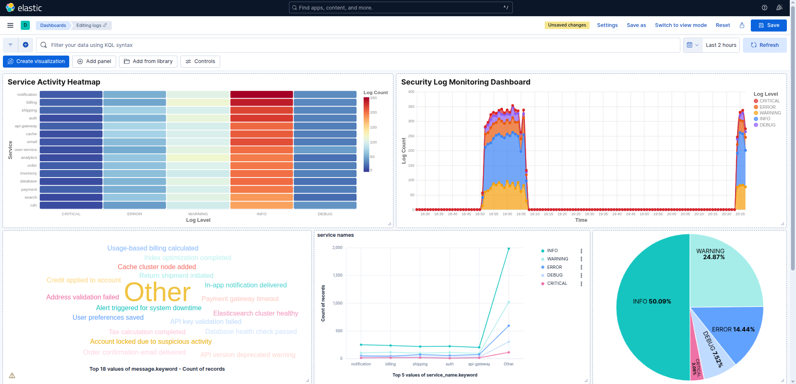
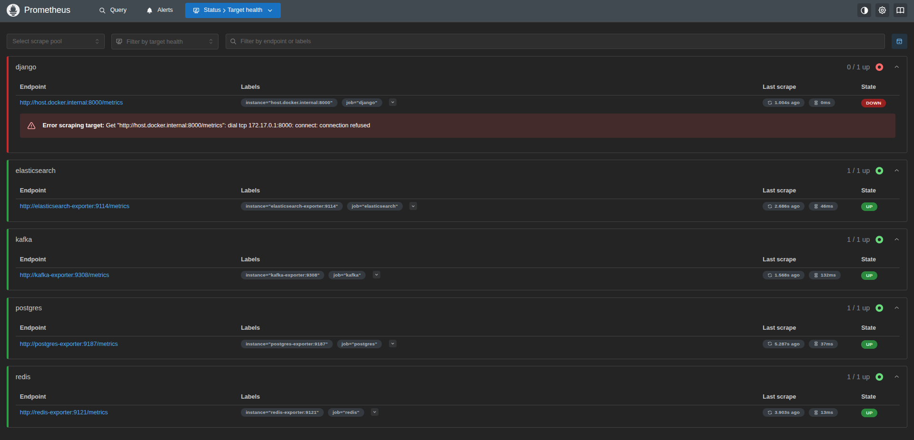

## Log Monitoring Application

A distributed log monitoring system built with Django, Kafka, PostgreSQL, Redis, Elasticsearch, and Kibana.

This project provides an API-driven log monitoring solution with authentication, rate limiting, message queuing, and centralized log search.

> Note: Full observability (metrics + traces + dashboards) is available in the [SigNoz integration branch](https://github.com/0xk4n3ki/logTraffic-Monitor/tree/feature/sigNoz-integration) .

The main branch documents the original Elasticsearch + Kibana stack, with Prometheus/Grafana attempted but not fully working.

### Features
- Log Ingestion API: devices send logs securely with API keys.
- API Key Management: users can create/manage keys (JWT protected).
- Rate Limiting: Redis enforces per-key request limits (600/minute).
- Reliable Processing: Kafka buffers log events, consumer persists to PostgreSQL.
- Search & Analysis: logs indexed in Elasticsearch, visualized with Kibana.
- Monitoring Attempt: Prometheus + Grafana were integrated, but Django metrics scraping failed (see below).

### Architecure

```
Client -> Django API (API Key Auth) -> Kafka -> Consumer -> PostgreSQL
                                             └-> Elasticsearch -> Kibana
```

### Monitoring Status

- Kibana: Works as expected. Logs are searchable and dashboards are functional.



- Prometheus: Could not scrape Django metrics due to connection issues. Error example from http://localhost:9090/targets:

```
Error scraping target: Get "http://host.docker.internal:8000/metrics": dial tcp 172.17.0.1:8000: connect: connection refused
```



- Grafana: Configured with Prometheus as datasource but dashboards were incomplete due to above failure.


### Setup

#### Prerequisites
- Python 3.12+
- Docker & Docker Compose

#### Clone & Configure

```bash
git clone https://github.com/0xk4n3ki/logTraffic-Monitor.git
cd logTraffic-Monitor
```

Create .env:

```ini
SECRET_KEY=your_django_secret_key
DB_NAME=log-monitor
DB_USER=postgres
DB_PASSWORD=postgres
DB_HOST=localhost
DB_PORT=5432
KAFKA_BROKER_URL=localhost:9092
ELASTICSEARCH_HOST=http://localhost:9200
```

Run

```bash
docker compose up -d
python manage.py runserver
python manage.py run_kafka_consumer
```

### Alternative: SigNoz Integration

For a modern observability stack with working logs, metrics, and traces:
- Check the feature/sigNoz-integration branch.